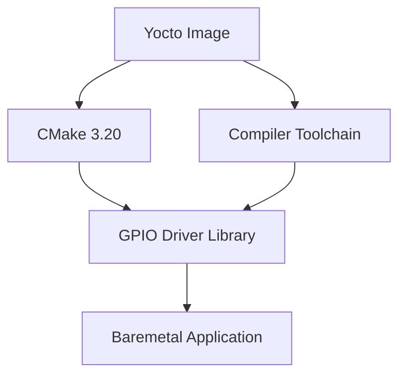

# Baremetal GPIO Driver for Raspberry Pi 3B+ with Yocto and CMake

## Overview

## System Architecture


This project demonstrates how to build a baremetal GPIO driver for Raspberry Pi 3B+ using:
- **Yocto** (core-minimal-image) for custom Linux image creation
- **CMake** as the build system
- **Modern C++17** and Object-Oriented Programming (OOP) principles
- Memory-mapped I/O for direct hardware register access

The driver provides basic GPIO functionality:
- Pin mode configuration (input/output)
- Digital read/write operations
- Pull-up/pull-down resistor control for inputs

---

## What I Did
1. **Integrated CMake** into Yocto's core-minimal-image
2. Created a **baremetal GPIO driver** using:
   - Memory-mapped I/O to access BCM2837 registers
   - C++ classes for encapsulation and abstraction
3. Configured cross-compilation toolchain for ARM64
4. Implemented environment setup for CMake on target device

---

## Prerequisites
- Yocto Project environment (Kirkstone)
- Raspberry Pi 3B+ hardware
- Basic familiarity with:
  - Yocto bitbake workflows
  - CMake build systems
  - ARM64 architecture

---

## How to Replicate the Setup

### 1. Add CMake to Yocto Image
Add these lines to your `conf/local.conf`:
```conf
IMAGE_INSTALL:append = " gcc g++ make cmake binutils"
```

### 2. Build and Deploy Image
```bash
bitbake core-image-minimal -k
# Flash the generated image to SD card
```

### 3. Environment Setup on Raspberry Pi
### Post-Boot Configuration
After flashing and booting the Yocto image on the Raspberry Pi 3B+, you may find that CMake cannot locate the required compilers. Since the **core-minimal-image** runs on `sh` (not `bash`), the correct place to define environment variables is `.profile`, not `.bashrc`.

To fix this, add the following lines to `~/.profile`:
```bash
# Set compiler paths for sh shell
echo "export CC=/usr/bin/aarch64-poky-linux-gcc" >> ~/.profile
echo "export CXX=/usr/bin/aarch64-poky-linux-g++" >> ~/.profile
echo "export AS=/usr/bin/aarch64-poky-linux-as" >> ~/.profile

# Apply immediately
source ~/.profile
```

---

## GPIO Driver Implementation

#### Memory Mapping Approach

Memory-mapped I/O is used to directly access the Raspberry Pi’s GPIO registers. This is done by mapping the physical memory address space of the GPIO peripheral into the user space, enabling low-level access without requiring an operating system.

---

## Future Enhancements

Possible improvements include:
- Expanding the driver to support **interrupt-based GPIO handling**.
- Providing a **CMake cross-compilation setup** for building on a host machine.
- Implementing additional **configuration options** for GPIO settings.

---
